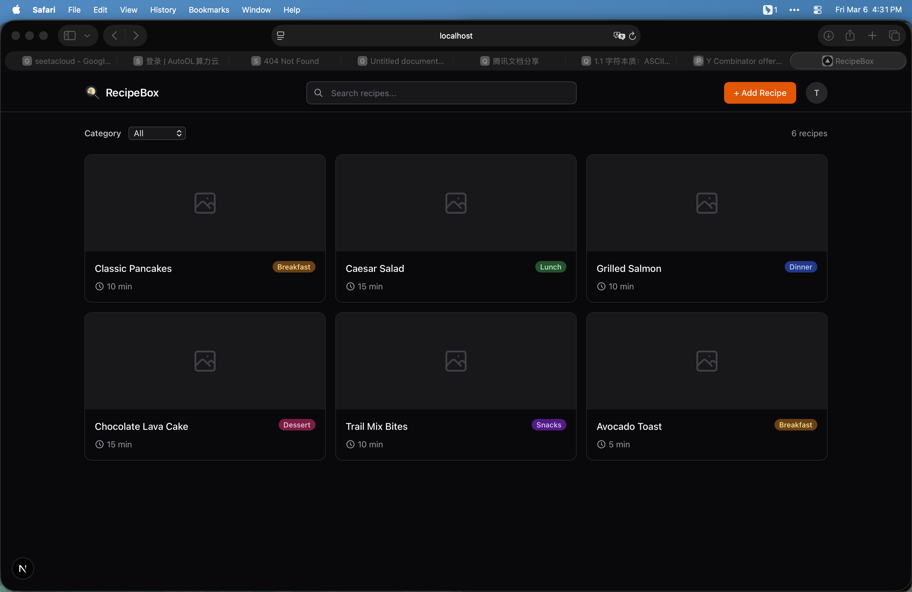
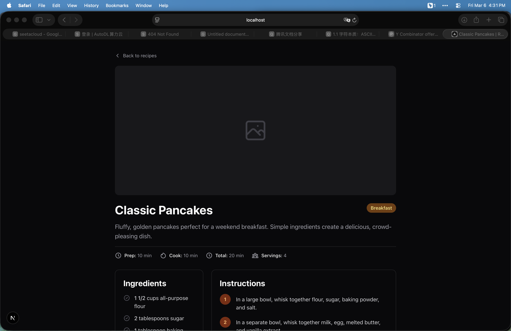
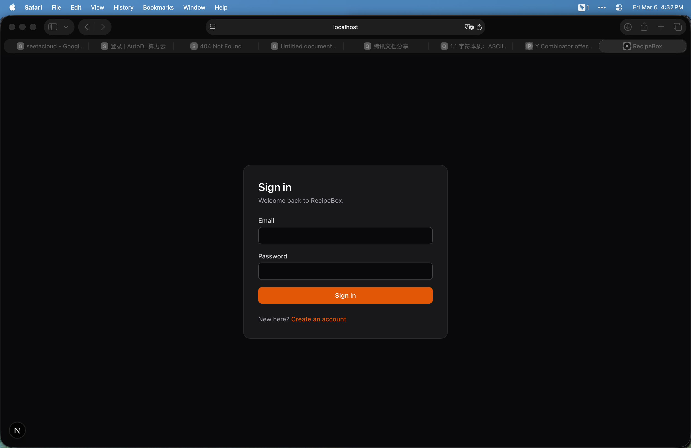

# User Guide

## Screenshot
Dashboard

Detail Page

Login Page

## Troubleshooting

**Issue: Can't log in**
Solution: Verify credentials are correct. Clear browser cache and cookies, then try again.

**Issue: Recipes not loading**
Solution: Check internet connection. Refresh the page. If problem persists, log out and log back in.

**Issue: Recipe details not showing**
Solution: Ensure you're logged in. Try accessing the recipe from the main dashboard.

## FAQ

**Q: How do I create an account?**
A: Click "Register" on the login page and fill in your details.

**Q: Can I filter recipes by category?**
A: Yes, use the category filter on the dashboard to browse recipes by type.

**Q: How do I view recipe ingredients and instructions?**
A: Click on any recipe card to view full details including ingredients, instructions, and cooking time.
